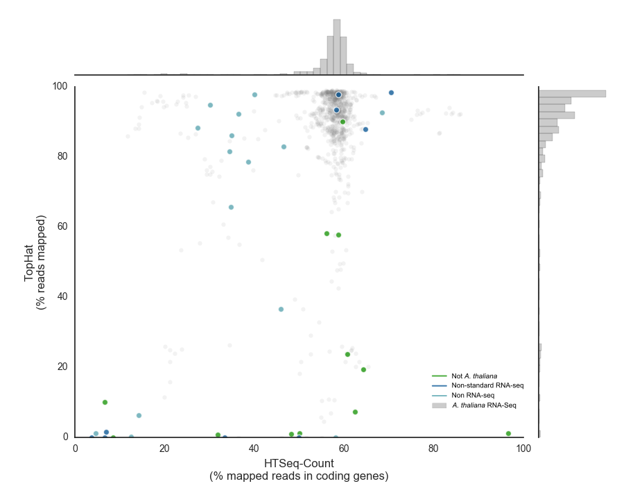

# Quality Control

## Overview
LSTrAP is designed to process large volumes of RNA Seq data to ultimately construct co-expression networks. However, 
while composing a sufficiently large dataset sample not suited to construct such networks might be erroneously included.
To detect those samples and warn users LSTrAP checks two parameters for each sample. The percentage of reads that map
to the genome (reported by TopHat) can be indicative for issues. The figure below shows proper samples (gray circles), 
and the majority have very high mapping percentages (y-axis). Samples from species that are not *Arabidopsis thaliana*
have fewer reads mapping. 

Also samples from experiments not designed to determine expression levels might be included, while some of these map 
very good to the genome (e.g. whole genome sequencing, non-coding RNA or small RNA studies), the reads don't correspond 
to coding genes. This can be seen in the percentage of mapped reads that align with coding genes (reported by 
HTSeq-Count). For good samples the median value is roughly 60% while some types of unsuited samples have less.

Based on this comparison LSTrAP will warn users if samples where less than 65% of the reads map to the genome are 
included or samples were less than 40% of the mapped reads are located in coding genes. Samples are *not* automatically
excluded from further analysis as there are (albeit a limited number) of good samples (e.g. single-cell transcriptomics
tend to have fewer reads mapping onto the genome due to mutations introduced during amplificiation steps) that have low
scores for one of these criteria.

An overview of samples that could have potential problems can be found in *lstrap.log*

## How to remove spureous samples

In case *lstrap.log* contains samples that need to be removed, remove the corresponding .htseq file for that sample and
restart the pipeline skipping all previous steps like this:

    ./run.py config.ini data.ini --skip-interpro --skip-orthology --skip-bowtie-build --skip-trim-fastq --skip-tophat --skip-htseq --skip-qc